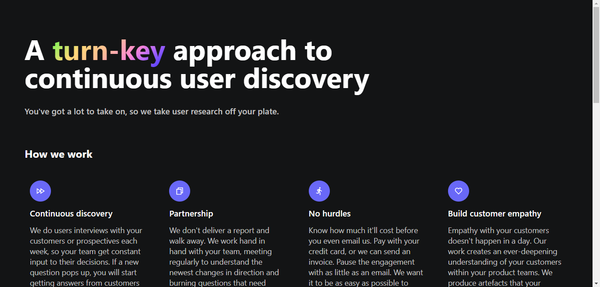
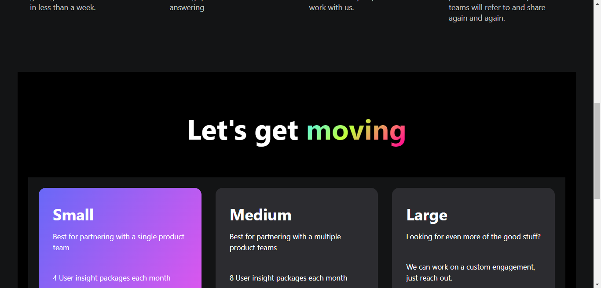
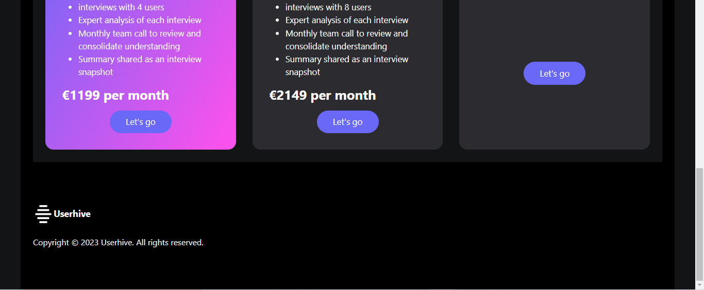

# UserHive_Clone

UserHive Website Clone: This project is a clone of Userhive website, with the use of mapping for structuring.

## Getting Started

Clone or download this repository and run with a local server of open `index.html` with your favorite browser

## Prequisite

- Your browser version must be recent for a better experience

## Features

- Description Page
- Purpose Page
- Package Page

## Tech/framework used

- HTML
- CSS
- ReactJS
- Vite
- Tailwind-CSS

## Preview

[Preview Here](https://grand-zabaione-876734.netlify.app)

## Contact

If you want to contact me you can reach me at
-wolabash@gmail.com -https://github.com/PrimeFord

## Addtional Info

- This is one of the series of project for the @Codevillage Programming Lessons.
- This is not meant for production. It's for learning purpose only
